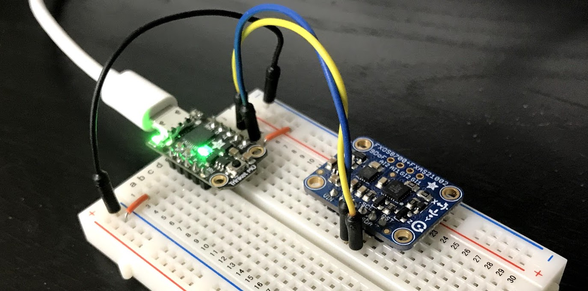

# IMU Data

## Software

- `read-serial.py`: python code for the computer to read serial data and store it
- `code.py`: is the circuitpython code run on the trinket

**Limitation:** CircuitPython only seems to allow 30Hz from the print command

## Hardware

- [Adafruit Trinket M0](https://www.adafruit.com/product/3500) as a I2C to USB Serial interface
- [NXP 9DOF IMU](https://www.adafruit.com/product/3463)

## Data Sets

All data sets are stored using [`the_collector`](https://pypi.org/project/the-collector/) which 
is just a generic interface to `json` and `pickle` storage.

- Accelerometer: 6 sets, x,y,z up/down while still
- Magnetometer: tumble across all axes
- Gyros: same as accerlometer
